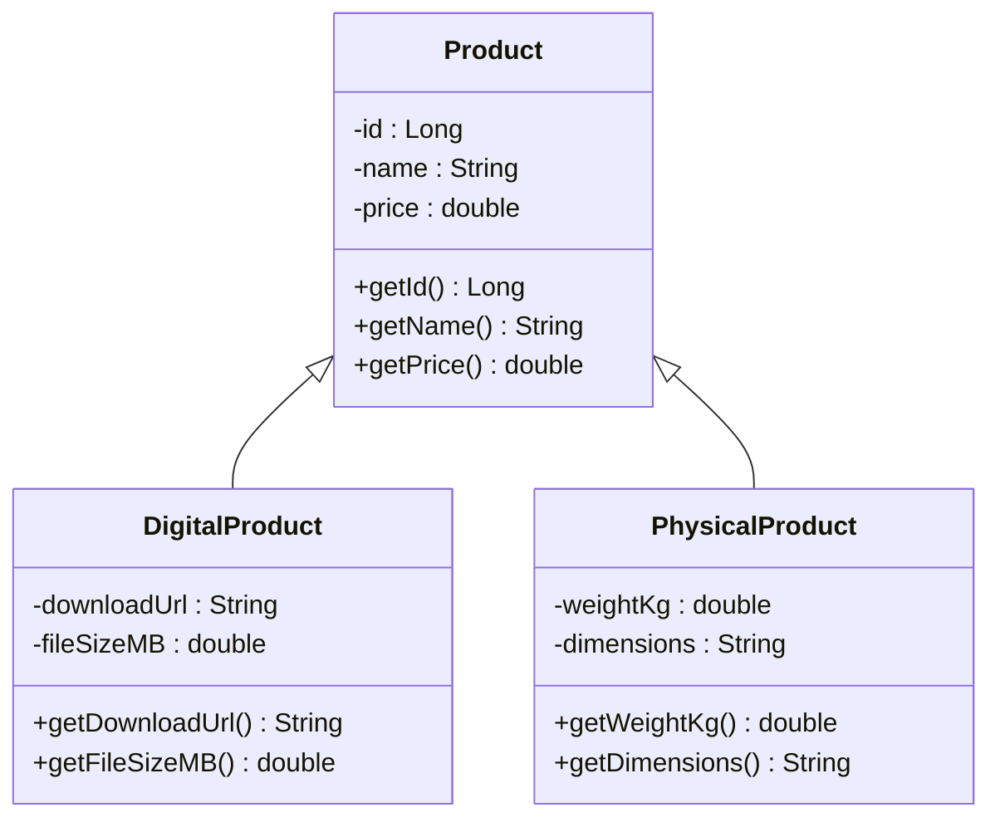

# Product Hierarchy — UML Class Diagram

DigitalProduct and PhysicalProduct both extend Product. The hollow triangle sits at the parent (Product).

```mermaid
classDiagram
    class Product {
        -id : Long
        -name : String
        -price : double
        +getId() Long
        +getName() String
        +getPrice() double
    }
    class DigitalProduct {
        -downloadUrl : String
        -fileSizeMB : double
        +getDownloadUrl() String
        +getFileSizeMB() double
    }
    class PhysicalProduct {
        -weightKg : double
        -dimensions : String
        +getWeightKg() double
        +getDimensions() String
    }
    Product <|-- DigitalProduct
    Product <|-- PhysicalProduct
```
